[Docs](README.md) · [What works today](STATUS.md) · [Run the examples](INFERENCE_EXAMPLES.md)

# Models, illustrated

The nine main sampler demonstrations all ask the same question: **what is the
room's average temperature, given noisy readings?** Their [room model](#room-temperature)
includes small temperature fluctuations as well as measurement noise.

The tests use additional models with independently calculated answers. Each
algorithm can also be used with other models that fit its supported interface.

## Which algorithm uses which model?

| Algorithm | Models in the main validation suite |
| --- | --- |
| LW | [Coin probability](#coin-probability), [event rate](#event-rate), [Gaussian mixture](#gaussian-mixture) |
| LWIS | [Coin probability](#coin-probability), [event rate](#event-rate), [Gaussian mixture](#gaussian-mixture) |
| Trace MH | [Coin probability](#coin-probability), [event rate](#event-rate), [Gaussian mixture](#gaussian-mixture) |
| SMC | [Classification](#classification), [hidden process](#hidden-process), [sensor calibration](#sensor-calibration) |
| RMSMC | [Classification](#classification), [hidden process](#hidden-process), [sensor calibration](#sensor-calibration) |
| PMMH | [Classification](#classification), [hidden process](#hidden-process), [sensor calibration](#sensor-calibration) |
| SMC² | [Classification](#classification), [hidden process](#hidden-process), [sensor calibration](#sensor-calibration) |
| Checkpoint SMC | [Classification](#classification), [hidden process](#hidden-process), [sensor calibration](#sensor-calibration) |
| HMC | [Thermometer](#thermometer), [linear regression](#linear-regression), [logistic intercept](#logistic-intercept) |
| MALA | [Thermometer](#thermometer), [linear regression](#linear-regression), [logistic intercept](#logistic-intercept) |
| Finite enumeration | [Machine alarm](#machine-alarm), [two coins](#two-coins), [heater](#heater) |

The sampling matrix uses three seeds per model and method. Enumeration has
deterministic checks. SMC, PMMH and SMC² also have a separate [small SIR posterior
test](#sir). The larger SIR example still has the documented PMMH/SMC² recovery
failures. [Budgets and validation results →](MULTI_MODEL_VALIDATION.md)

The diagrams describe how each model generates data. Inference uses the observed
data to learn about the unknown values. They are model illustrations, not plots
of sampler results.

## Room temperature

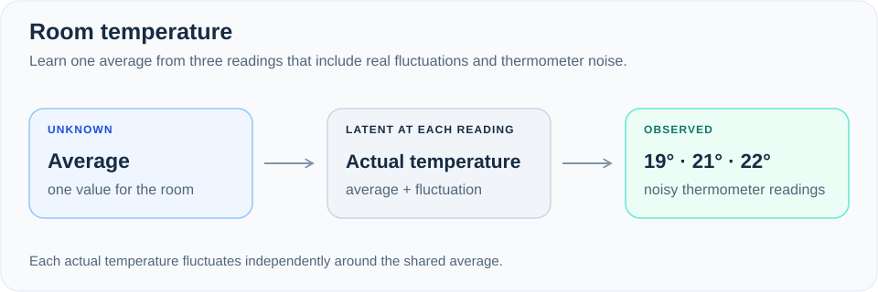

**Question:** what is the room's average temperature? The observed readings are
**19, 21 and 22°C**. Each reading has its own unobserved actual temperature,
allowing the room to fluctuate around its average.

**Demonstrated with:** LW, LWIS, MH, SMC, RMSMC, PMMH, SMC², HMC and MALA.
The ordinary and differentiable versions use the same statistical assumptions
through different interfaces. [Example and exact answer](INFERENCE_EXAMPLES.md) ·
[Ordinary model](../examples/inference.kk) · [Differentiable model](../examples/gradient_inference.kk)

## Thermometer

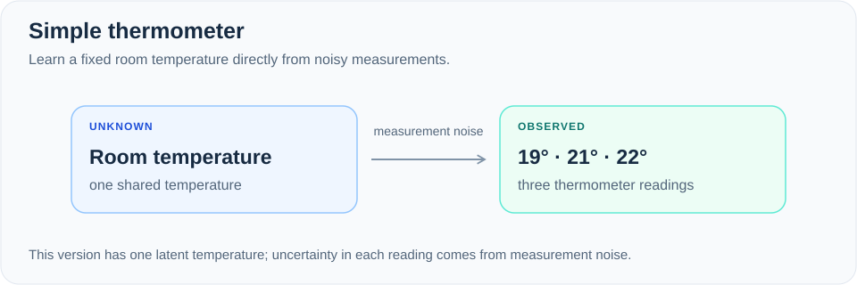

**Question:** what is a constant temperature measured by a noisy thermometer?
The readings are again **19, 21 and 22°C**. This simpler model has one unknown
temperature and measurement noise, with no separate temperature fluctuations.
Its exact posterior differs from the room model above.

**Checked with:** HMC and MALA in the gradient validation suite. It is also the
LW quick-start model and the LW/checkpoint-SMC handler demonstration.
[First example](TEMPERATURE.md) · [Gradient tests](../tests/gradient_examples.kk) ·
[Handler example](HANDLER_COMPOSITION.md)

## Coin probability

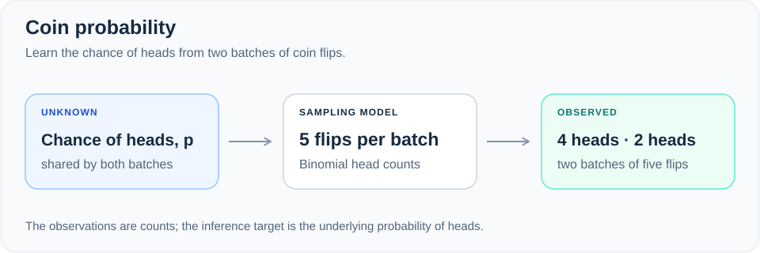

**Question:** how likely is this coin to land heads? Two batches of five flips
produce **four heads, then two heads**. A Beta prior and Binomial observations
give an exact Beta posterior for comparison.

**Checked with:** LW, LWIS and trace MH. [Model and checks](../tests/trace_examples.kk)

## Event rate

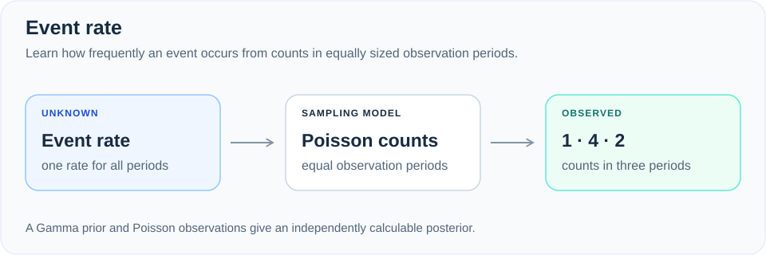

**Question:** how often does an event happen? The observed counts are **1, 4 and 2**
over equal observation periods. A Gamma prior and Poisson observations give an
exact Gamma posterior for the event rate.

**Checked with:** LW, LWIS and trace MH. [Model and checks](../tests/trace_examples.kk)

## Gaussian mixture

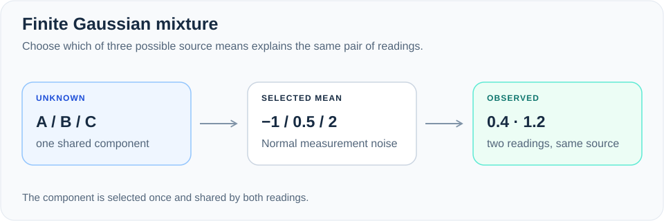

**Question:** which of three possible sources produced both measurements?
The sources have means **−1, 0.5 and 2**; the readings are **0.4 and 1.2**.
One shared, unknown component determines both readings. The three posterior
probabilities can be calculated directly.

**Checked with:** LW, LWIS and trace MH. [Model and checks](../tests/trace_examples.kk)

## Classification

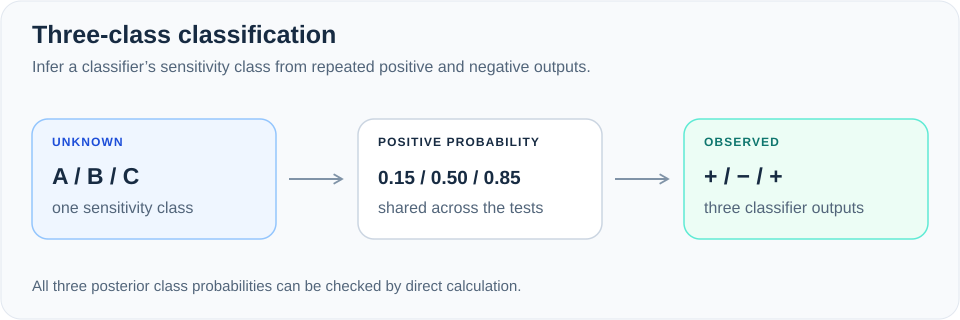

**Question:** which response class best explains **positive, negative, positive**?
The three classes have positive-response probabilities **0.15, 0.5 and 0.85**.
The class remains fixed across observations.

**Checked with:** SMC, RMSMC, PMMH, SMC² and checkpoint SMC.
[Model and checks](../tests/particle_examples.kk)

## Hidden process

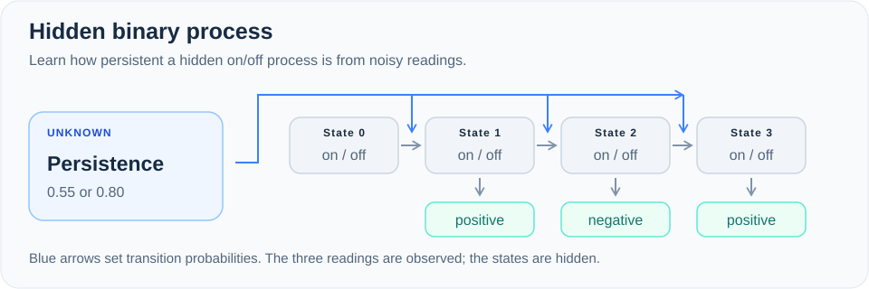

**Question:** what hidden on/off states produced the readings, and how persistent
is the process? The observations are **positive, negative, positive**. A hidden
state can stay the same or switch at each step; an unknown parameter chooses
between two persistence levels. Exhaustive enumeration supplies the reference answer.

**Checked with:** SMC, RMSMC, PMMH, SMC² and checkpoint SMC.
[Model and checks](../tests/particle_examples.kk)

## Sensor calibration

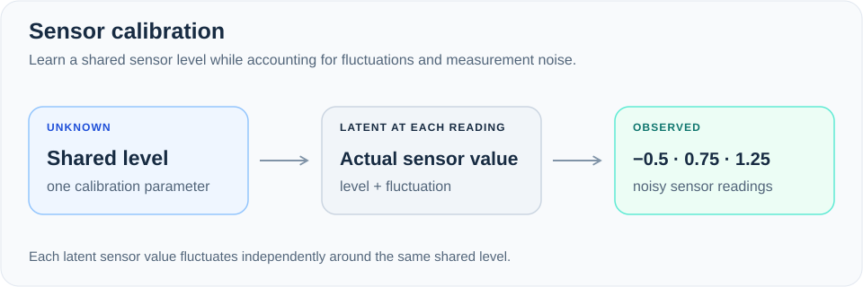

**Question:** what shared sensor level explains readings **−0.5, 0.75 and 1.25**?
Each reading has a fresh unobserved value around that level, followed by
measurement noise. The tests check both the shared parameter and the final
latent value, including their covariance, against an analytic Gaussian answer.

**Checked with:** SMC, RMSMC, PMMH, SMC² and checkpoint SMC.
[Model and checks](../tests/particle_examples.kk)

## Linear regression

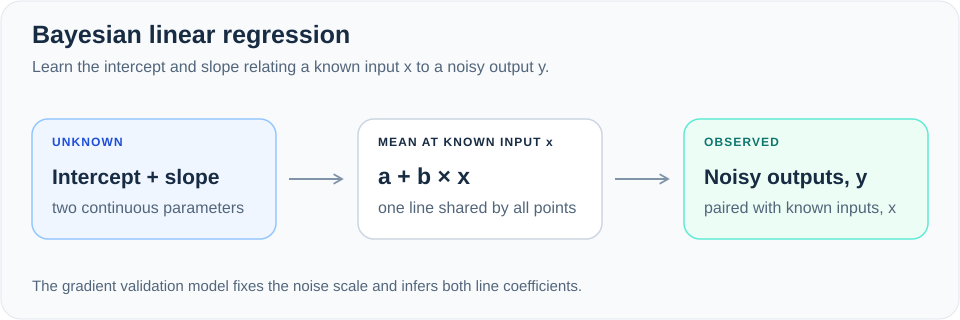

**Question:** which intercept and slope explain a set of noisy points?
The observed pairs are **(−1, −1), (0, 1), (1, 2), (2, 3)**. Normal priors and
Normal measurement noise give an analytic joint posterior for the two coefficients.

**Checked with:** HMC and MALA. [Model and checks](../tests/gradient_examples.kk)

## Logistic intercept

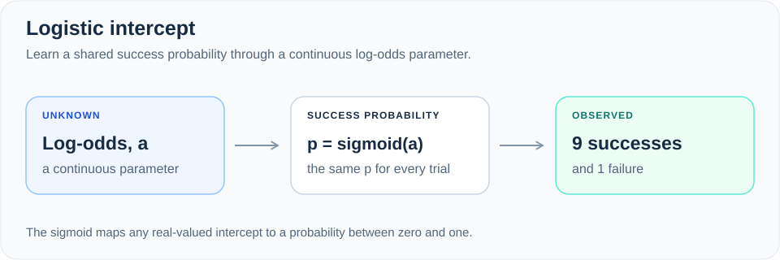

**Question:** what success probability explains **nine successes and one failure**?
The unknown is a real-valued log-odds parameter, converted to a probability by
the logistic function. There are no predictor variables in this model.
Independent numerical integration supplies its non-Gaussian posterior reference.

**Checked with:** HMC and MALA. [Model and checks](../tests/gradient_examples.kk)

## Machine alarm

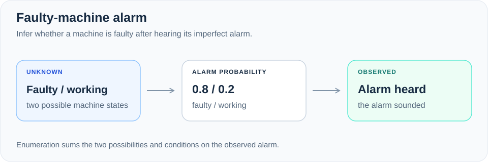

**Question:** after an alarm sounds, how likely is a fault? The prior fault
probability is **0.3**. The alarm sounds with probability **0.8** when faulty and
**0.2** when healthy. Enumerating the two possibilities gives a fault probability
of **12/19 ≈ 0.632** after hearing the alarm.

**Demonstrated with:** finite enumeration. [Guide](EXACT_INFERENCE.md) ·
[Runnable model](../examples/exact_inference.kk)

## Two coins

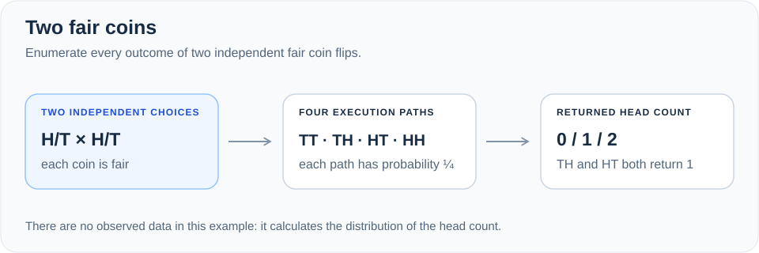

**Question:** how many heads do two fair coins produce? **No data is observed.**
Enumeration visits four paths and groups them into three outcomes: **0, 1 or 2
heads**, with probabilities **¼, ½ and ¼**.

**Demonstrated with:** finite enumeration. [Runnable model](../examples/exact_inference.kk)

## Heater

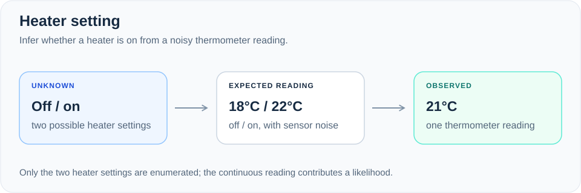

**Question:** is the heater on after a **21°C** thermometer reading? There are
two possible settings: **off**, with mean temperature **18°C**, or **on**, with
mean **22°C**. The reading has Normal noise. Only the discrete heater setting
is enumerated; the observed temperature contributes a likelihood density.

**Demonstrated with:** finite enumeration. [Runnable model](../examples/exact_inference.kk)

## SIR

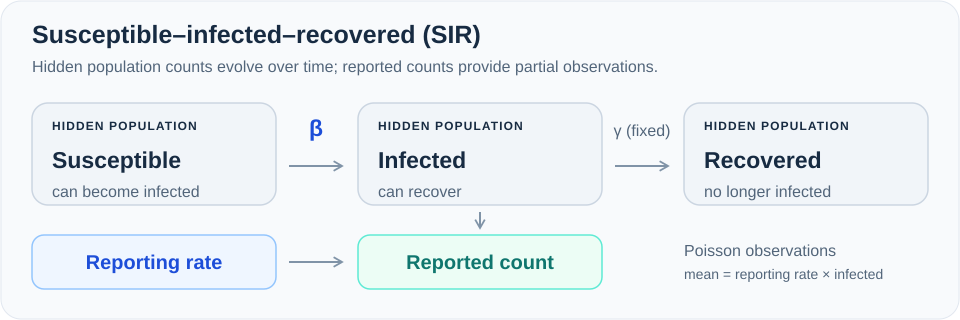

**Question:** which infection and reporting rates explain observed case counts?
The model tracks susceptible, infected and recovered people. A Poisson
observation model turns the hidden infected count into reported cases.
The recovery rate is fixed in the checks described here.

**Exact-posterior check:** SMC, PMMH and SMC² run on a five-person model with
four possible infection/reporting parameter pairs and observations **0, 1, 1**.
All nine algorithm/seed runs passed their stated tolerances. RMSMC is not part
of this small SIR suite. [Test and reference answer](INFERENCE_AUDIT.md#small-sir-posterior-check)

**Larger example:** the SMC/RMSMC/PMMH/SMC² report uses continuous parameters
and a larger population. PMMH and SMC² still miss its parameter-recovery
thresholds at the recorded budgets. Passing the small-model checks does not
resolve those failures. [Recorded limitation](INFERENCE_AUDIT.md#known-empirical-limitation)

## Run them

```sh
make examples        # Shared temperature demos, finite enumeration and handlers
make test-examples   # Three-model validation suites, with three seeds per method
make test-enumerate  # Deterministic finite-enumeration checks
make test-sir        # Small SIR posterior and diagnostic-summary checks
```

See [what works today](STATUS.md) for supported interfaces, missing gradients
through inference, and the limits of the correctness evidence. The separate
[baseline benchmarks](BENCHMARKS.md) cover additional elementary regression cases.
